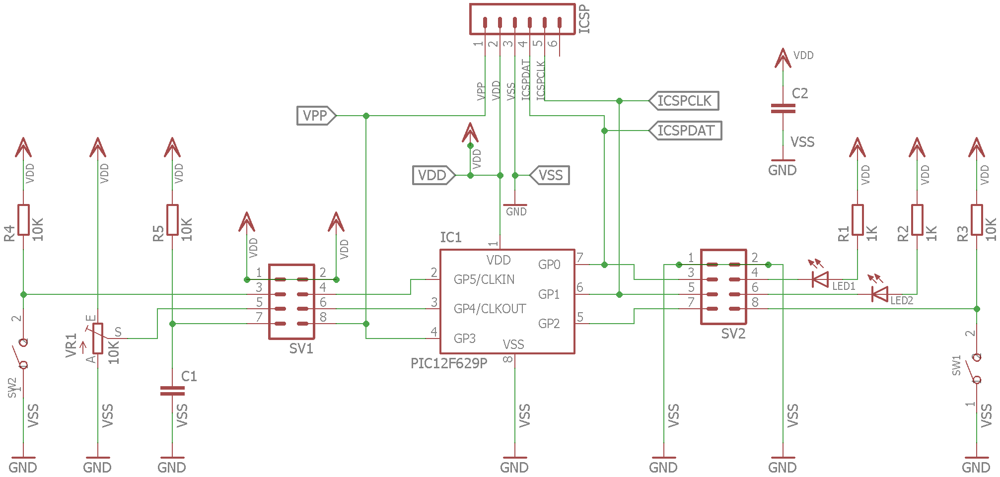
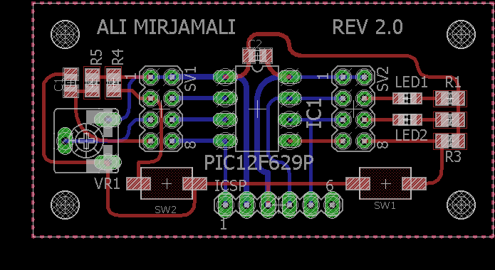
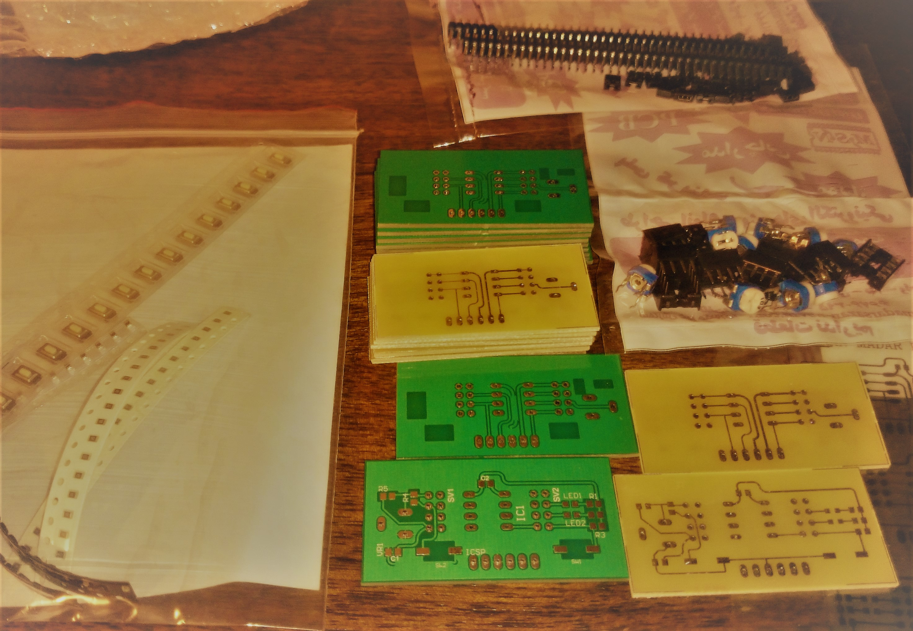

# Microchip PIC12F629 breakout board

This is a small simple development board for 8 pin PIC micro-controllers.
I made this simple board to practice [Julian Ilett's](https://www.youtube.com/playlist?list=PLjzGSu1yGFjXSEIsOsaYfKl1xmPcji2f-) 
PIC Assembly Language Tutorials easily without requiring breadboarding or original PCB (which I did not like).
This PCB could be directly connected to & powered from PICkit 3.

## Schematic

## PCB

## Rev 1.0 PCBs

# Sample code
There is currently a simple LED dimming code in C in Hello World directory.
I will rewrite it in PIC Assembly once I learn more from Julian's Tutorial.

# License

This hardware is licensed under [Creative Commons Share Alike](http://creativecommons.org/licenses/by-sa/4.0/).

Sample Hello World C code is licensed under GPL v2.0 
